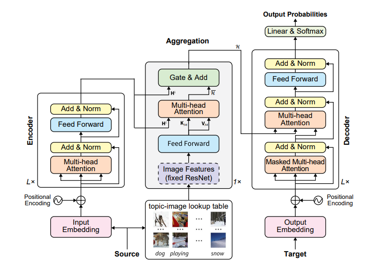
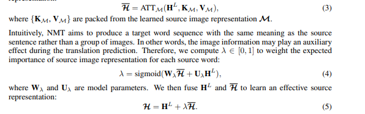

对问题已经讨论的挺多的了，你能不能总结一下泛化性想要解决的问题？再把这个问题跟dk数据集比较一下吧。

我们提到过一些概念：对未知数据的处理能力、常识、习惯用语，领域知识、数据库结构、直接匹配v.s.理解。

从编码知识的角度，图像和文本是两个不同的问题。结构化知识库应该跟两者都有差异，但是说不定跟文本还是更接近一点吧？VQA可能会有一些关于模态对齐的工作可以参考？

==================================================================================================================================

#### 注意力方法(attention)
注意力方法的目的是关注图片中**与问题相关的区域**或者关注**问题中最关键的词**,这一机制模拟了人脑的认知模式,即根据实际需求而将有限的注意力聚焦于事物的关键部分,从而大大加强了神经网络的理解能力。图像区域不应该仅获得来自问题文本的信息，而且需要与其他图像区域产生关联。
> 有点像Text-to-SQL中的match，但这算是理解了语言文本后去定位的有效信息。Q-KV的方式找语义相似的部分做Attention的fusion(区别于match)[Neural Machine Translation with Universal Visual Representation]

> 2020年左右的貌似都喜欢加入GAN，同时当时也有点流行记忆网络。一个有点重要的就是模态之间的**共性和个性**(其认为并不是所有模态都很重要)。

#### tmp_thought
> 当前多模态领域较对于模态对齐方面，重心集中于融合方法(近期均在注意力机制上改进)与训练策略(MLM、MRM、对比学习等)，对于text2sql领域因为sql与text对并不一定能相互补充，相互推理，他们的关系是sql能回答text的问题，因此掩码方法训练效果理论上不好，使用对比学习可能能取得良好效果。

#### Language Quantized AutoEncoders: Towards Unsupervised Text-Image Alignment $\color{red} {No} $
> 3 February, 2023; v1 submitted 2 February, 2023
建议在不依赖配对文本的情况下将未对齐的图像编码到语言空间。**专注于使用文本模型来完成图像任务**。让BERT，GPT3之类的模型具有在few-shot解决图像方面问题的能力。

#### 还是先看写博客吧，能够有些基础只是，多关注模态对齐上：
> https://blog.csdn.net/weixin_36362326/article/details/112680896#:~:text=%E5%A4%9A%E6%A8%A1%E6%80%81%E5%AF%B9%E9%BD%90%E5%AE%9A%E4%B9%89%E4%B8%BA,%E5%87%BA%E5%89%A7%E6%9C%AC%E4%B8%AD%E5%93%AA%E4%B8%80%E6%AE%B5%EF%BC%89

> https://blog.csdn.net/weixin_52471370/article/details/129798870?spm=1001.2101.3001.6650.1&utm_medium=distribute.pc_relevant.none-task-blog-2%7Edefault%7EAD_ESQUERY%7Eyljh-1-129798870-blog-112680896.235%5Ev27%5Epc_relevant_landingrelevant&depth_1-utm_source=distribute.pc_relevant.none-task-blog-2%7Edefault%7EAD_ESQUERY%7Eyljh-1-129798870-blog-112680896.235%5Ev27%5Epc_relevant_landingrelevant&utm_relevant_index=2

#### ViLT
> ViLT是首个将VE设计的如TE一样轻量的方法，该方法的主要计算量都集中在模态交互上(**concat然后输入Transformer encoder**)。传统VLP中视觉方面计算量需求太大，即使是使用一些目标检测等方式以减轻特征提取的负担，但在实际应用程序中，局限性仍然很明显，因为野外的查询必须经历一个缓慢的提取过程(慢)。——训练方式MLM、ITmatch。

#### Neural Machine Translation with Universal Visual Representation
> Q-KV的方式找语义相似的部分做Attention的fusion(区别于match)使用带有门控加权的注意力层将视觉信息和文本信息融合为解码器的输入。主体还是跟ALBEF一样的attention，加了个Gate and Add感觉可以试试。

#### Mutilmodal Feature Extraction and Attention-based Fusion for Emotion Estimation in Videos
> 18 March, 2023
单纯跟ALBEF一样的交叉注意力机制，不过这个是一共3个模态，面部表情作为query模态。

#### Exploring Multimodal Sentiment Analysis via CBAM Attention and Double-layer BiLSTM Architecture
> March 2023
文本方面有个神奇东西，BERT+BiLSTM，融合方面首先CNN然后CBAM处理后才去交叉注意力机制的

#### HICLIP-contrastive language-image pretraining with hierarchy-aware attention
> 6 March 2023 Accepted at ICLR 2023
层次聚合改善多模态对齐，捕捉视觉和语言的层次结构。项目根据其重要性或复杂程度进行排序或排序。相对于CLIP改进在对齐之前的单独处理中，可以学习一下文本方面的tree-transformer——捕捉文本中传达的细粒度语义的分层性质(或许参考性不大)

#### Cross-modal Contrastive Learning for Multimodal Fake News Detection
> 25 February, 2023
旨在通过**跨模态对比学习实现更精确的图像文本对齐**。为了进一步提高对齐精度，该框架**利用辅助任务来软化负样本的损失项**。此外，该框架还开发了一个**跨模态融合模块**来学习跨模态相关性，并实现了一个注意力机制，以帮助有效地聚合对齐的单模态表示和跨模态相关性。
文章除了使用对比学习还使用一致性学习(对于text2sql不一定适用)，这篇文章的特征融合方式没怎么见过，感觉参考价值不是很大。

#### VAE
> 学习潜在分布，能识别不符合该分布的数据点，且是一个生成模型。

#### BEiT：Image as a Foreign Language: BEIT Pretraining for All Vision and Vision-Language Tasks
> 也是使用的多头交叉注意力机制，掩码训练以及对比学习对齐。
https://arxiv.org/pdf/2208.10442v2.pdf

#### Robustness of Fusion-based Multimodal Classifiers to Cross-Modal Content Dilutions(时间多再看)
> 4 November, 2022